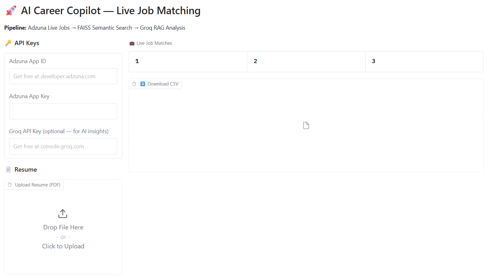
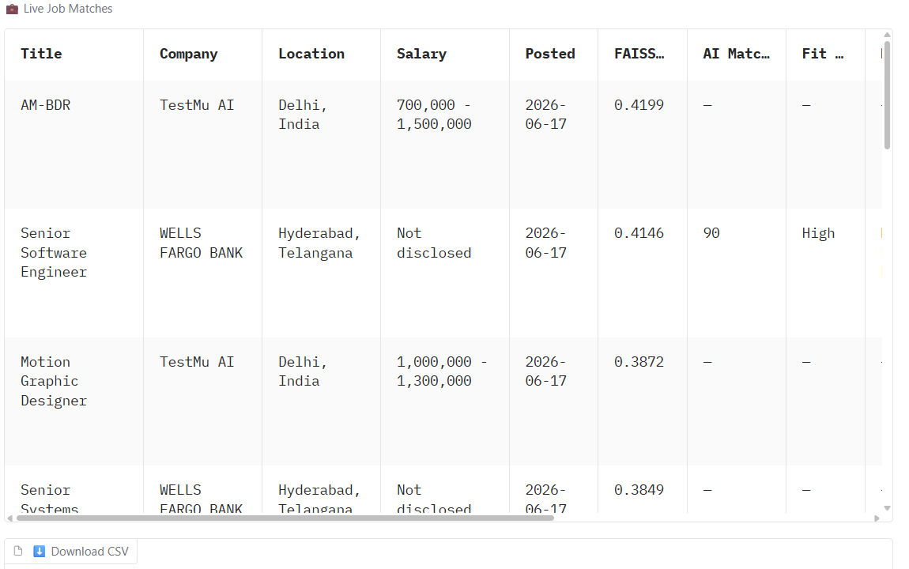
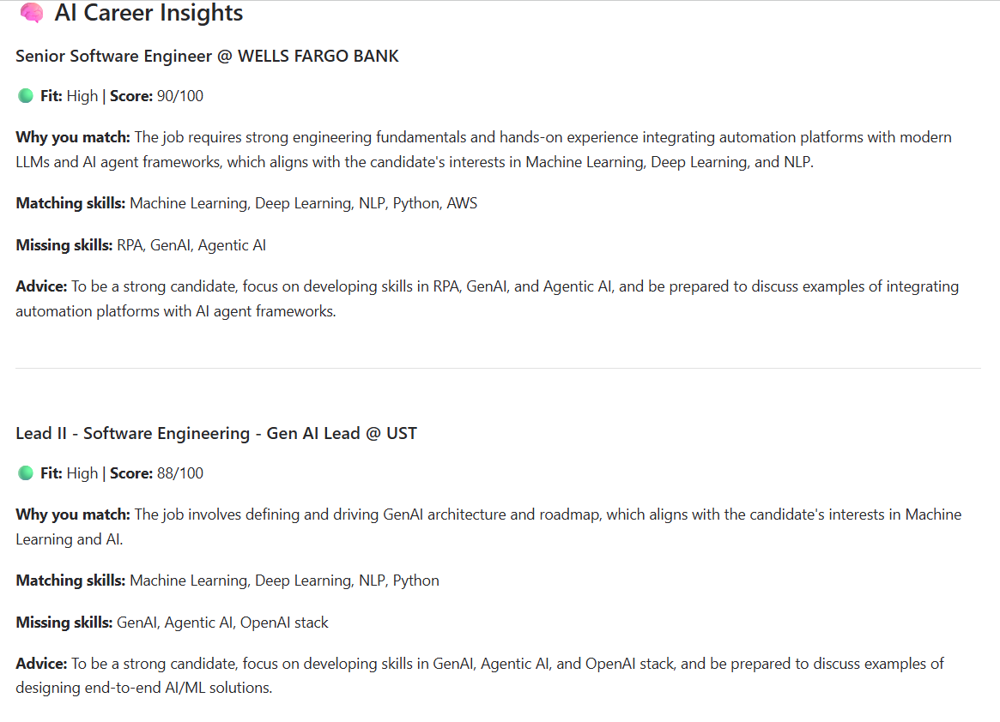
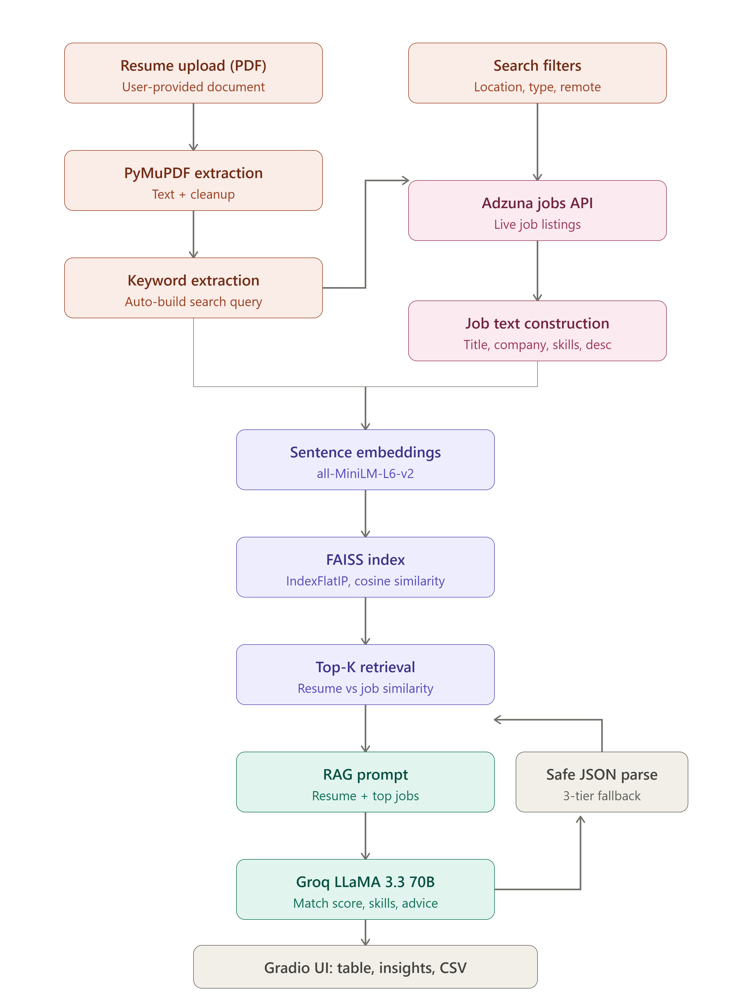

# 🚀 AI Career Copilot — Live Job Matching with RAG

> An intelligent job-matching system that fetches **real-time job listings**, ranks them using **semantic vector search**, and generates **AI-powered career insights** — all in one seamless pipeline.


### 🔗 [Live Demo on HuggingFace Spaces](https://huggingface.co/spaces/ishaan05/job_prediction)

---

##  Overview

**AI Career Copilot** solves a real problem with most resume-matching tools: they rely on stale, hardcoded datasets full of expired job postings. This project instead pulls **live job listings** directly from the **Adzuna Jobs API**, builds a **FAISS vector index on the fly**, and uses **Retrieval-Augmented Generation (RAG)** with **Groq's LLaMA 3.3 70B** to deliver recruiter-quality insights — match scores, skill gaps, and personalized career advice — in seconds.

Upload your resume. Get ranked, real, currently-open jobs. Understand exactly why you match — and what's missing.

---
## 📸 Screenshots

### Job Matching Interface


### Live Job Results Table


### AI Career Insights


---

## ✨ Key Features

-  **Resume Parsing** — Extracts and cleans text from any PDF resume
-  **Live Job Fetching** — Real-time listings via Adzuna API (no stale datasets)
-  **Semantic Search** — FAISS-powered vector similarity ranking, not just keyword matching
-  **RAG-Powered Insights** — LLM analyzes top matches and explains *why* you fit
-  **Robust JSON Parsing** — Multi-layer fallback parser handles imperfect LLM output gracefully
-  **Skill Gap Analysis** — See exactly which skills you have and which you're missing
-  **Smart Filters** — Location, employment type, remote-only toggle
-  **Export Results** — Download all matches as CSV
-  **Zero Setup for Users** — Just paste API keys and go, no backend config needed
  ---
  
## 🏗️ Architecture



## ⚙️ How It Works

1. **Resume Upload & Parsing** — The user uploads a PDF resume, which is parsed using PyMuPDF and cleaned of noise (HTML tags, URLs, special characters).

2. **Query Generation** — If the user doesn't manually specify a job title, the system auto-extracts the most frequent meaningful keywords from the resume to use as a search query.

3. **Live Job Retrieval** — The query, along with location and employment type filters, is sent to the **Adzuna Jobs API**, which returns real, currently active job postings.

4. **Embedding & Indexing** — Each job posting is converted into a structured text block (title, company, skills, location, description) and embedded into a vector using `all-MiniLM-L6-v2`. These vectors are loaded into an in-memory **FAISS `IndexFlatIP`** index for fast similarity search.

5. **Semantic Retrieval** — The resume itself is embedded the same way, and FAISS retrieves the **top-K most semantically similar jobs** — going far beyond simple keyword matching to understand contextual meaning.

6. **RAG-Based Analysis** — The top retrieved jobs, along with the full resume text, are passed into a carefully engineered prompt sent to **Groq's LLaMA 3.3 70B** model. The LLM reasons over this retrieved context to select the best 5 jobs and generate match scores, fit levels, matching/missing skills, and tailored career advice — this is the **"Generation"** step of RAG.

7. **Safe JSON Parsing** — LLM outputs aren't always perfectly formatted JSON. A dedicated `safe_json_parse()` function handles this gracefully with a 3-tier fallback: direct parsing → stripping markdown code fences → regex-extracting the JSON array from surrounding text. This ensures the app never crashes due to a malformed LLM response.

8. **Results Display** — All results are rendered in an interactive Gradio table with FAISS scores, AI match scores, and skill breakdowns, plus a downloadable CSV and a detailed insights panel.

---
##**Tech Stack**
Python
Gradio
Sentence Transformers (all-MiniLM-L6-v2)
FAISS
Groq API — LLaMA 3.3 70B
PyMuPDF
Adzuna API
Pandas, NumPy
Requests
HuggingFace Spaces

---

### 1. Adzuna API (Required)
Used to fetch live, real-time job listings.
- Sign up free at **[developer.adzuna.com](https://developer.adzuna.com)**
- Free tier: **250 requests/day**
- You'll receive an **App ID** and **App Key**

### 2. Groq API (Optional, but recommended)
Used to power the RAG-based AI career insights (match scores, skill gaps, advice).
- Sign up free at **[console.groq.com](https://console.groq.com)**
- Generous free tier with fast inference (LLaMA 3.3 70B)
- Without this key, the app still works — you'll get FAISS-ranked job matches, just without the AI-generated insights

>  **Privacy note:** Keys are entered as password-masked fields and used only for that session's API calls. They are never stored, logged, or persisted anywhere.

---

## 🚀 Getting Started

### Option 1 — Try it instantly (no setup)
👉 **[Live Demo on HuggingFace Spaces](https://huggingface.co/spaces/ishaan05/job_prediction)

Just paste your Adzuna and Groq keys into the UI and start matching.

### Option 2 — Run locally

**Clone the repository**
```bash
git clone https://github.com/yourusername/ai-career-copilot.git
cd ai-career-copilot
```

**Install dependencies**
```bash
pip install -r requirements.txt
```

**Run the app**
```bash
python app.py
```

The app will launch on `http://localhost:7860`

---

## 📂 Project Structure
ai-career-copilot/
│
├── app.py              
├── requirements.txt    
├── README.md            
└── .gitignore
---

## 📋 Requirements

```txt
gradio[oauth,mcp]==5.33.0
sentence-transformers>=2.6.0
faiss-cpu
pymupdf
groq
requests
pandas
numpy
```

---

## 🎯 Usage

1. Open the app (locally or via the live demo link)
2. Enter your **Adzuna App ID** and **App Key**
3. *(Optional)* Enter your **Groq API Key** for AI insights
4. Upload your resume as a **PDF**
5. Set filters — location, employment type, remote-only
6. Click **🔍 Find Jobs**
7. Review your FAISS-ranked matches in the table
8. Scroll down to see detailed **AI Career Insights** for your top 5 matches
9. Download results as **CSV** for offline reference

---

## 🧪 Example Output

| Title | Company | FAISS Score | AI Match Score | Fit Level |
|---|---|---|---|---|
| Data Engineer | WNS | 0.4387 | 85/100 | High |
| AWS Data Engineer | Virtusa | 0.4102 | 90/100 | High |

**AI Insight Example:**
> **Why you match:** The candidate's experience with AWS and machine learning skills make them a strong fit for this role.
> **Missing skills:** ETL, Data Lakes
> **Advice:** Focus on developing expertise in ETL and data lakes, and stay up-to-date with the latest AWS services.

---

## 🔮 Future Improvements

- [ ] Add support for multiple job sources (Remotive, The Muse) as automatic fallbacks
- [ ] Persistent FAISS index caching to reduce repeated embedding computation
- [ ] Resume improvement suggestions based on aggregated skill gaps across all matches
- [ ] Multi-resume comparison mode
- [ ] Support for DOCX resumes in addition to PDF

---

## 🤝 Contributing

Contributions, issues, and feature requests are welcome! Feel free to check the [issues page](https://github.com/yourusername/ai-career-copilot/issues) or submit a pull request.

---

## 📄 License

This project is licensed under the **MIT License** — feel free to use, modify, and distribute.

---

## 🙏 Acknowledgements

- [Adzuna](https://www.adzuna.com) for the free job listings API
- [Groq](https://groq.com) for blazing-fast LLM inference
- [Sentence Transformers](https://www.sbert.net) for embedding models
- [FAISS](https://github.com/facebookresearch/faiss) by Meta AI Research
- [Gradio](https://www.gradio.app) for the UI framework

---

